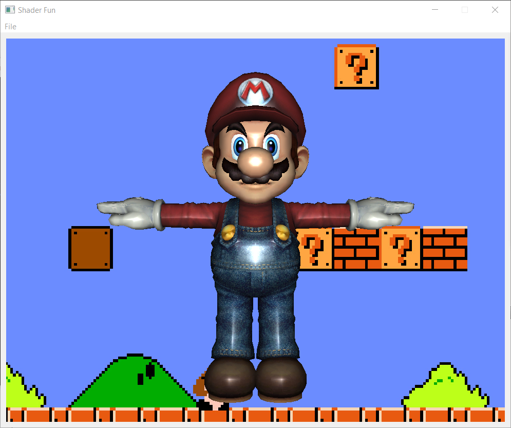
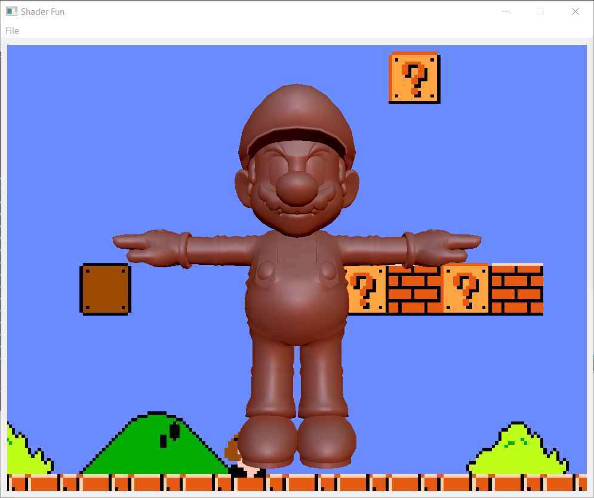
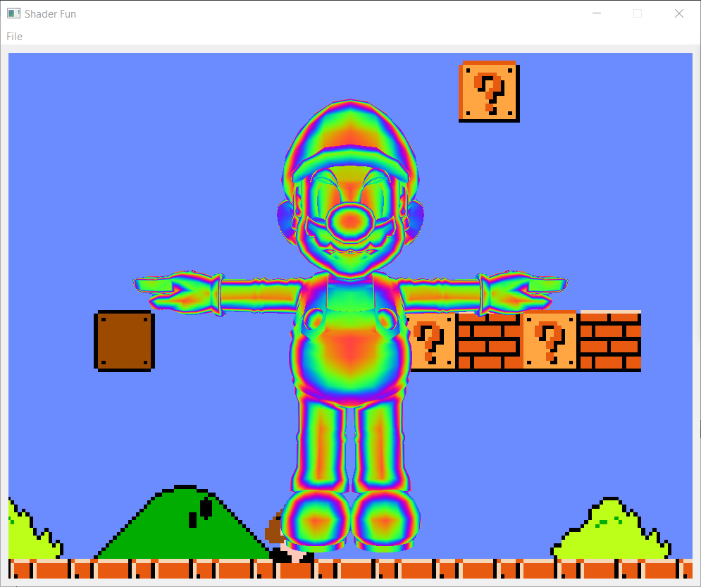
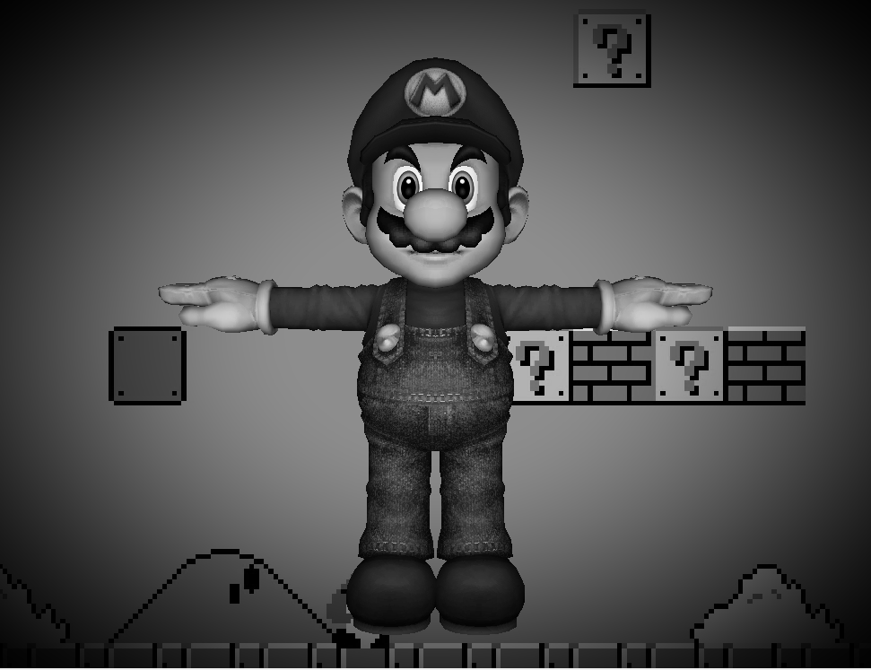
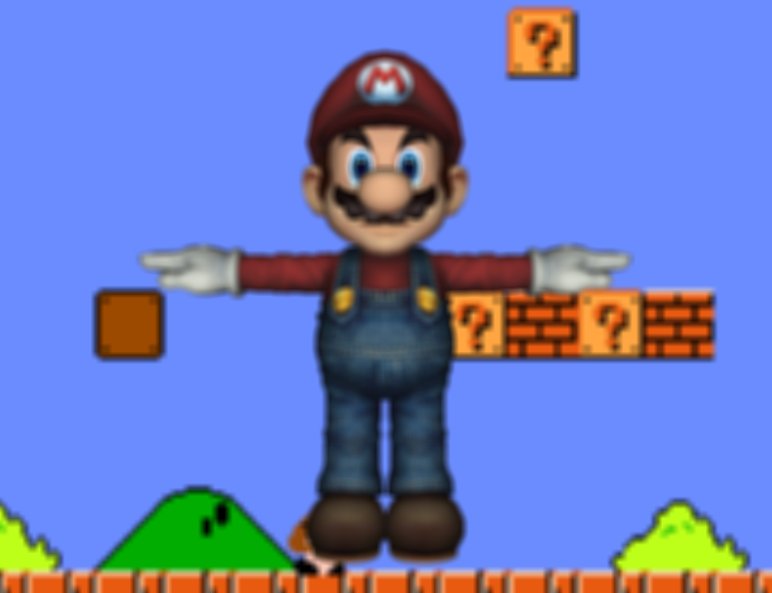
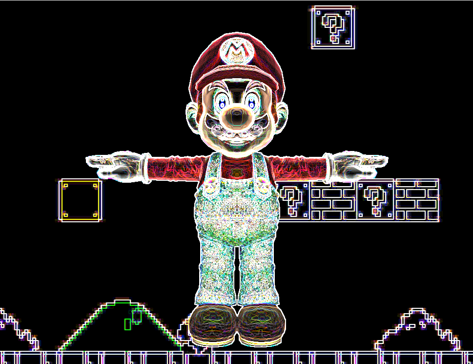
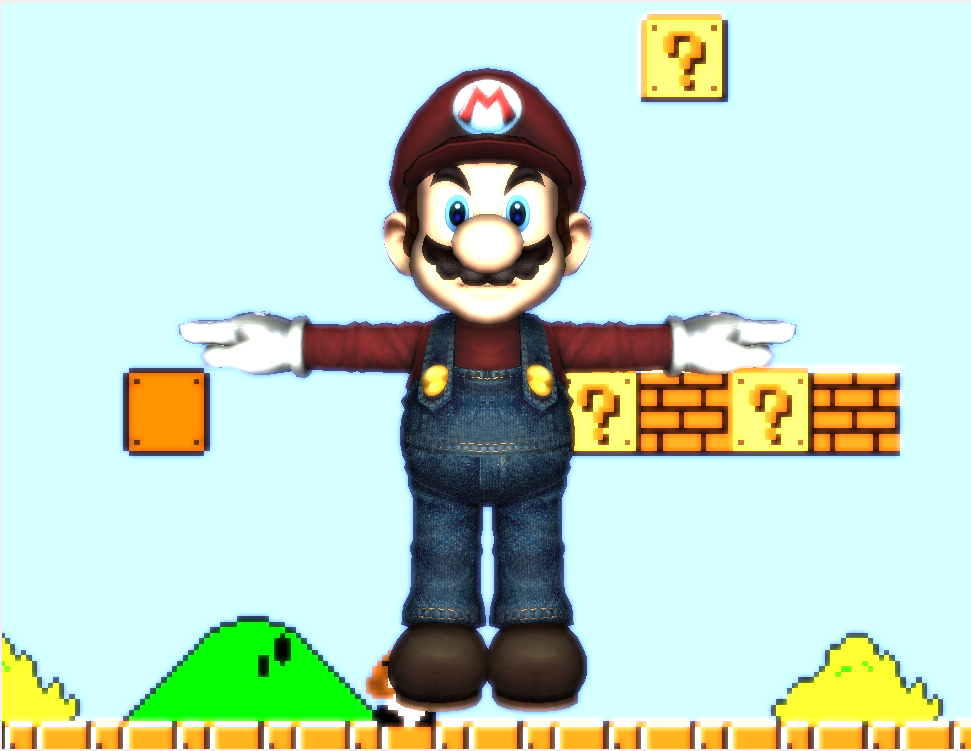

# ShaderFun
Implemented various artistic shaders with GLSL based on OpenGL pipeline.
## Pre-Process Shaders
### The Blinn-Phong Reflection Shader

### The Matcap Reflection Shader
The "Matcap" method uses designed material spheres to give 3D models the appearance of a complex material with dynamic lighting without having to perform expensive lighting calculations.

### The Iridescent Shader
In this shader a cosine color palette is chosen with the Lambertian dot product as the t value to exhibit a iridescent effect.

## Post-Porcess Shaders
### The Greyscale and Vignette Shader

### The Gaussian Blur Shader
A Gaussian blur effectively performs a weighted average of NxN pixels and stores the result in the pixel at the center of that NxN box.

### The Sobel Filter Shader
A Sobel filter effectively detects and enhances the edges of shapes in the 3D scene. It computes the approximate gradient of the color at each pixel, and where the color abruptly changes it returns a high value, otherwise it returns roughly black, or a slope of zero.

### The Fake Bloom Shader
Conducting a threshold test on the average of surrounding pixel color to fake the blooming effect with only one step. 

